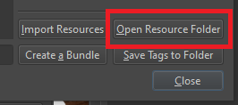

# Cyanic SD-Krita Plugin

A Krita Plugin to work with the Automatic1111 WebUI and SD.Next WebUI


**Note:** This plugin is in a "Usable Alpha" state. It might crash, or might not be compatible with your server settings. Things are expected to change somewhat frequently.

# Updates
**Nov 2 2023** - Hires Fix support added.

**Oct 28 2023** - Better Inpaint Masking options (Thank you Miraihi [for all your help finding bugs](https://github.com/DrCyanide/cyanic-sd-krita/issues?q=author%3AMiraihi+))

**Oct 26 2023** - Lora, Textual Inversion, and Hypernetwork lists added, under Extra Networks 

**Oct 25 2023** - Batch controls added, Simplify UI tab added (to hide features you don't use to make it more like Fooocus)

**Oct 20 2023** - RemBG support added, ControlNet Preprocessor Previews supported.

**Oct 17 2023** - Upscaler support added.

**Oct 5 2023** - ADetailer support added.

**Oct 4 2023** - Inpainting added.

**Oct 3 2023** - First iteration of ControlNet support added. 


# Install Instructions
1. Ensure your server has API access. For A1111, this means adding `--api` to your webui-user.bat (or equivalent) `COMMANDLINE_ARGS`
2. Open Kritam then go `Settings > Manage Resources`, then in the bottom right click the `Open Resource Folder` button




3. Find the `pykrita` folder inside the explorer window Krita opened up
4. There's two options for installing the extension:
    * Easy install, annoying update - Download the project and put both the folder `cyanic` and the file `cyanic.desktop` in your `pykrita` folder. You'll have to redownload and recopy the files to this path any time you wish to update.
    * Annoying install, easy update - Git clone the project, then create a symlink in the `pykrita` folder to `cyanic` and `cyanic.desktop`. Anytime you do a git pull it'll update the plugin.
        * **Windows**: Open Command Prompt by right clicking it and selecting "Run as Administrator..." and run these commands
            ```bat
            mklink /j "path_to_your_pykrita_folder\cyanic" "path_to_your_git_pull\cyanic"
            mklink "path_to_your_pykrita_folder\cyanic.desktop" "path_to_your_git_pull\cyanic.desktop"
            ```
        * **Linux**: Open a terminal and run these commands
            ```sh
            ln -s "path_to_your_pykrita_folder/cyanic" "path_to_your_git_pull/cyanic"
            ln -s "path_to_your_pykrita_folder/cyanic.desktop" "path_to_your_git_pull/cyanic.desktop"
            ```
5. Restart Krita and go to `Settings > Configure Krita...`, then at the bottom left side of the window until you see `Python Plugin Manager`. Click that, then check the box to enable `Cyanic SD Plugin for Krita`

6. Restart Krita one more time
7. You should see a docked `Cyanic SD` window in Krita. If it's not showing up, go to `Settings > Dockers` and check the box next to `Cyanic SD`

# Plugin Basics
**NOTE**: This description was written while the app was in "Usable Alpha". The design might change as the project matures.

Since I prefer to use Krita on my laptop, I wanted this plugin to be as compact as possible. An abundance of tabs makes the WebUI's too bulky, so it was replaced with a dropdown bar in this plugin.


Similar to the WebUI, there are categories that are collapsible. 


The Style selection is done by selecting a checkbox next to the name of the style. Any checked style will be passed to the server to be included with the prompt/negative prompt. Clicking "Add to Prompt" will uncheck all styles and add their corresponding prompt/negative prompts to the fields where you can fine tune them. 


Selecting a source image for Img2Img has a few options. Selecting "Use Layer" will narrow the selection to the bounds of the current layer, while "Use Canvas" will select the entire canvas. **NOTE**: "Use Layer" doesn't expose or hide any other layers - it only refers to the size image.


Inpainting masks are super simple to make - just create a new layer and draw. Any color works, as do multiple colors, because the end mask is based on the transparency of the pixels in your active layer. 


Want something a little bit more like Fooocus, with fewer settings in your way? "Simplify UI" to reduce the amount of clutter.


# Not yet implemented
* Generation Settings
    * CFG
    * Clip Skip
    * Tiling
    * Face Restore
* Extensions
    * Roop/ReActor
* Extra Features
    * ControlNet Segmentation Mask color lookup
    * Webcam-to-layer

# Not planning to implement
* Scripts
* Outpainting
* Other extensions
